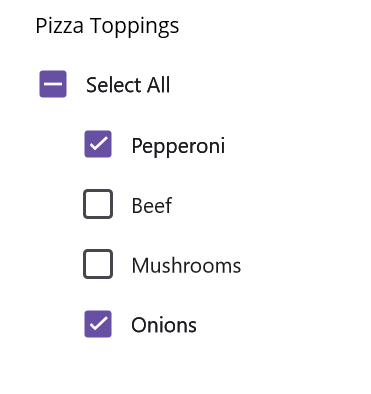
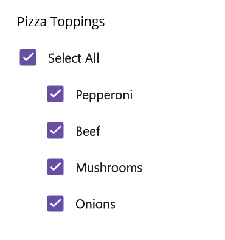

# Getting Started with .NET MAUI CheckBox (SfCheckBox)

This section provides a quick overview for working with the SfCheckBox for .NET MAUI. Walk through the entire process of creating a real world of this control.

## Creating an application using the .NET MAUI CheckBox
 1. Create a new .NET MAUI application in Visual Studio.
 2. Syncfusion .NET MAUI components are available on [nuget.org](https://www.nuget.org/). To add SfCheckBox to your project, open the NuGet package manager in Visual Studio, search for Syncfusion.Maui.Buttons and then install it.

## Register the handler

To use this control inside an application, you must register the handler for Syncfusion® core.

**C#**
```
using Microsoft.Extensions.Logging;
using Syncfusion.Maui.Core.Hosting;

namespace CheckBoxGettingStarted
{
    public static class MauiProgram
    {
        public static MauiApp CreateMauiApp()
        {
            var builder = MauiApp.CreateBuilder();
            builder
                .UseMauiApp<App>()
                .ConfigureSyncfusionCore()
                .ConfigureFonts(fonts =>
                {
                    fonts.AddFont("OpenSans-Regular.ttf", "OpenSansRegular");
                    fonts.AddFont("OpenSans-Semibold.ttf", "OpenSansSemibold");
                });

#if DEBUG
    		builder.Logging.AddDebug();
#endif

            return builder.Build();
        }
    }
}

```

## Add a basic CheckBox
1. Import the control namespace `Syncfusion.Maui.Buttons` in XAML or C# code.
2. Initialize [SfCheckBox](https://help.syncfusion.com/cr/maui/Syncfusion.Maui.Buttons.SfCheckBox.html) control.

**XAML**
```
<ContentPage
    . . .    
    xmlns:buttons="clr-namespace:Syncfusion.Maui.Buttons;assembly=Syncfusion.Maui.Buttons">
        <buttons:SfCheckBox x:Name="checkBox"/>    
</ContentPage>
```

**C#**
```
    using Syncfusion.Maui.Buttons;
    namespace CheckBoxGettingStarted
    {
        public partial class MainPage : ContentPage
        {
            public MainPage()
            {
                InitializeComponent();           
                SfCheckBox checkBox = new SfCheckBox();
                this.Content = checkBox;
            }
        }   
    }

```

## Change the CheckBox state

The three visual states of [`SfCheckBox`](https://help.syncfusion.com/cr/maui/Syncfusion.Maui.Buttons.SfCheckBox.html) are: 

* Checked
* Unchecked
* Indeterminate

The [SfCheckBox](https://help.syncfusion.com/cr/maui/Syncfusion.Maui.Buttons.SfCheckBox.html) allows an Intermediate state in addition to the checked and unchecked state. The Intermediate state is enabled by setting the [IsThreeState](https://help.syncfusion.com/cr/maui/Syncfusion.Maui.Buttons.SfCheckBox.html#Syncfusion_Maui_Buttons_SfCheckBox_IsThreeState) property of the control to `True`.

N> When the [IsThreeState](https://help.syncfusion.com/cr/maui/Syncfusion.Maui.Buttons.SfCheckBox.html#Syncfusion_Maui_Buttons_SfCheckBox_IsThreeState) property is set to `False` and [IsChecked](https://help.syncfusion.com/cr/maui/Syncfusion.Maui.Buttons.SfCheckBox.html#Syncfusion_Maui_Buttons_SfCheckBox_IsChecked) property is set to `null`, the CheckBox will be in unchecked state.

The Intermediate state is used when a group of sub-choices has both checked and unchecked states. In the following example, the "Select all" CheckBox has the [IsThreeState](https://help.syncfusion.com/cr/maui/Syncfusion.Maui.Buttons.SfCheckBox.html#Syncfusion_Maui_Buttons_SfCheckBox_IsThreeState) property set to `true`. The "Select all" CheckBox is checked if all child elements are checked, unchecked if all the child elements are unchecked, and Intermediate otherwise.

**XAML**
```
    <StackLayout Padding="20">
        <Label x:Name="label" Margin="10" Text="Pizza Toppings"/>
        <buttons:SfCheckBox x:Name="selectAll" Text="Select All" IsThreeState="True" IsChecked="{x:Null}" StateChanged="SelectAll_StateChanged"/>
        <buttons:SfCheckBox x:Name="pepperoni" Text="Pepperoni" StateChanged="CheckBox_StateChanged" Margin="30,0"/>
        <buttons:SfCheckBox x:Name="beef" Text="Beef" IsChecked="True" StateChanged="CheckBox_StateChanged" Margin="30,0"/>
        <buttons:SfCheckBox x:Name="mushroom" Text="Mushrooms" StateChanged="CheckBox_StateChanged" Margin="30,0"/>
        <buttons:SfCheckBox x:Name="onion" Text="Onions" IsChecked="True" StateChanged="CheckBox_StateChanged" Margin="30,0"/>
    </StackLayout>

```

**C#**

```
SfCheckBox selectAll, pepperoni, beef, mushroom, onion;
public MainPage()
{
    InitializeComponent();
    StackLayout stackLayout = new StackLayout() { Padding = 20 };
    Label label = new Label();
    label.Text = "Pizza Toppings";
    label.Margin = new Thickness(10);
    selectAll = new SfCheckBox();
    pepperoni = new SfCheckBox();
    beef = new SfCheckBox();
    onion = new SfCheckBox();
    mushroom = new SfCheckBox();

    pepperoni.StateChanged += CheckBox_StateChanged;
    pepperoni.Text = "Pepperoni";
    pepperoni.Margin = new Thickness(30, 0);

    beef.StateChanged += CheckBox_StateChanged;
    beef.Text = "Beef";
    beef.IsChecked = true;
    beef.Margin = new Thickness(30, 0);

    mushroom.StateChanged += CheckBox_StateChanged;
    mushroom.Text = "Mushrooms";
    mushroom.Margin = new Thickness(30, 0);

    onion.StateChanged += CheckBox_StateChanged;
    onion.Text = "Onions";
    onion.Margin = new Thickness(30, 0);
    onion.IsChecked = true;

    selectAll.StateChanged += SelectAll_StateChanged;
    selectAll.Text = "Select All";
    selectAll.IsThreeState = true;
    selectAll.IsChecked = null;

    stackLayout.Children.Add(label);
    stackLayout.Children.Add(selectAll);
    stackLayout.Children.Add(pepperoni);
    stackLayout.Children.Add(beef);
    stackLayout.Children.Add(mushroom);
    stackLayout.Children.Add(onion);
    this.Content = stackLayout;
}

```

**C#**

```

    bool skip = false;
    private void SelectAll_StateChanged(object sender, Syncfusion.Maui.Buttons.StateChangedEventArgs e)
    {
        if (!skip)
        {
            skip = true;
            pepperoni.IsChecked = beef.IsChecked = mushroom.IsChecked = onion.IsChecked = e.IsChecked;
            skip = false;
        }
    }

    private void CheckBox_StateChanged(object sender, Syncfusion.Maui.Buttons.StateChangedEventArgs e)
    {
        if (!skip)
        {
            skip = true;
            if (pepperoni.IsChecked.Value && beef.IsChecked.Value && mushroom.IsChecked.Value && onion.IsChecked.Value)
                selectAll.IsChecked = true;
            else if (!pepperoni.IsChecked.Value && !beef.IsChecked.Value && !mushroom.IsChecked.Value && !onion.IsChecked.Value)
                selectAll.IsChecked = false;
            else
                selectAll.IsChecked = null;
            skip = false;
        }
    }
        
```

Run the application to render the following output:




